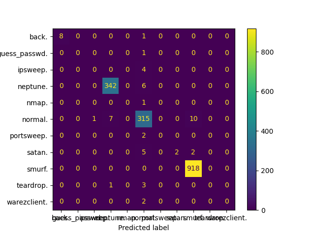
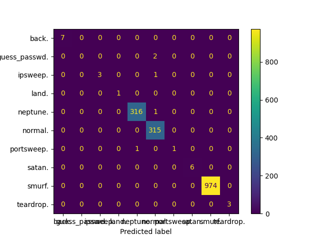
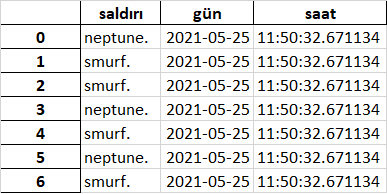

# BMT310-Grup1-DDoS_Mitigation_With_AI
BMT310-Grup1-DDoS_Mitigation_With_AI

## YAPAY ZEKA
### Kdd99 Veri Seti İnceleme ve Ön İşleme

Bu alanda alt problemimiz ise ddos saldırılarını sınıflandırmak.

Öğrenme algoritmaları büyük verileri işleyerek ilerde karşılaşacakları örneklerin çıktılarını tahmin etmeye çalışırlar.
bu tahmini matematiksel işlemlerle yaparlar. Dolayısıyla, verilerin algoritmalar tarafından anlaşılır olması 
için sayısal veri olması gerekir.
 

Kdd99 veri setinde 3 kolon kategorik veri içeriyor bunlar: 
protocol_type, 
flag, 
service 
Bu kolonları sayısal verilere çeviriyoruz.

#### Örnek olarak

### Tahminler

#### Decision tree

##### Doğruluk matrisi (confusion matrix)

#### DOĞRULUK ORANI
0.9951

#### KNN k nearest neighbors

##### Doğruluk matrisi (confusion matrix)

##### DOĞRULUK ORANI
0.9755

#### Random Forest 

##### Doğruluk matrisi (confusion matrix)

#### DOĞRULUK ORANI

0.9969

### Modülerlik

Projemizde KNN, Decision tree ... algoritmalarını kullanarak tespit yapabiliyoruz. Bu algoritmalar birbirleri
yerine geçebileceği için tamamı belli bir standartta yazıldı. tek bir satırla tahmin algoritması daha başarılı
algoritmayla değiştirilebilecek, yeni algoritmalar da sisteme eklenebilecek. 
Yapılan testlerle aldığımız kararlar sonucunda yazılım güncellemelerinde
bu değişiklikler uygulanacaktır.    

## TASARIM

## SAVUNMA

## RAPORLAMA

Sistem anormal trafikleri tespit ettiğinde log kayıtları tutuyor. Kullanıcı istediği zaman
excel dosyası olarak bu kayıtları dökümleyebiliyor.

