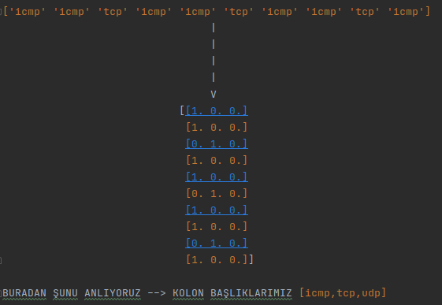

# BMT310-Grup1-DDoS_Mitigation_With_AI
BMT310-Grup1-DDoS_Mitigation_With_AI

## YAPAY ZEKA
### Kdd99 Veri Seti İnceleme ve Ön İşleme

Bu alanda alt problemimiz ise ddos saldırılarını sınıflandırmak.

Öğrenme algoritmaları büyük verileri işleyerek ilerde karşılaşacakları örneklerin çıktılarını tahmin etmeye çalışırlar.
bu tahmini matematiksel işlemlerle yaparlar. Dolayısıyla, verilerin algoritmalar tarafından anlaşılır olması 
için sayısal veri olması gerekir.
 

Kdd99 veri setinde 3 kolon kategorik veri içeriyor bunlar: 
protocol_type, 
flag, 
service 
Bu kolonları sayısal verilere çeviriyoruz.

#### Örnek olarak

### Tahminler

#### Decision tree

##### Doğruluk matrisi (confusion matrix)

#### DOĞRULUK ORANI
0.9951

#### KNN k nearest neighbors

##### Doğruluk matrisi (confusion matrix)

##### DOĞRULUK ORANI
0.9755

## WEB SİTESİ
####    Kullanıcılar bu web sitesini kullanarak DDoS Mitigation With AI masaüstü programını güncelleyebileceklerdir. 
#### DDoS Mitigation With AI web sitesinin anasayfası ekran fotoğrafı aşağıdadır.

####    Kullanıcılar bu web sitesini kullanarak DDoS Mitigation With AI masaüstü programının kullanma klavuzuna "KULLANMA KLAVUZU" yazısına tıklayarak erişebilmektedir.

####    Kullanıcılar DDoS Mitigation With AI masaüstü programının hizmet kapmasına kolaylıkla ulaşabilmektedir. Bunun için web sitesinde bulunan "HİZMETLERİMİZ" yazısına tıklamaları yeterli olacaktır.  

####    Kullanıcılar DDoS Mitigation With AI masaüstü programını geliştirenler hakkında bilgi sahibi olmak isterse "BİZ KİMİZ" yazısına tılaması yeterli olacaktır.Ayrıca kullanıcılar bir sorun olması durumunda web sitesinin sağ alt kısmında bulunan mail adresni tıklayarak ürün geliştiricilerine  yaşadıkları sorunlarını kolaylıkla aktarabileceklerdir.

## TASARIM

## SAVUNMA
